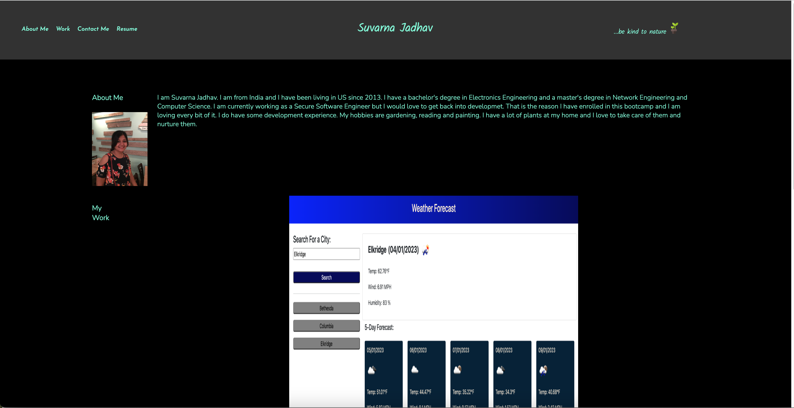

# suvarna-portfolio

## Description 

This is my portfolio website. If any employer wants to know about me and see the work I have done, they can visit my website and get an idea about my background. Below are the contents of this website.

* A small introduction about me and my photo.
* Work: Some of the projects I worked on until now, if  you click on the images of projects then it will take you to the actual deployed websites.
* Contact me section with my phone number, email and a link to my GitHub profile (Note: For now I have not included any of the actual contact information).
* For resume, I have not included any actual resume for now.

## Features

* Responsive layout to adjust to different screen sizes.
* When you hover over "About Me", "Work", "Contact Me" or "Resume" in the header section, it will change the background color, opacity and shadow. When you click on these different tabs then it will take you to the respective section in the website. 
* When you hover over any of the application in "My Work" section, the application image will change background color, opacity and shadow to show that you are on the current application.

## Installation

N/A

## Screenshot

## Link to the deployed application

https://suvarna28.github.io/suvarna-portfolio/

## Credits

* Our Teaching Assistant Sebastian for very helpful feedback on my first draft of the website.
* Google Fonts, I have used some fonts from google fonts.
